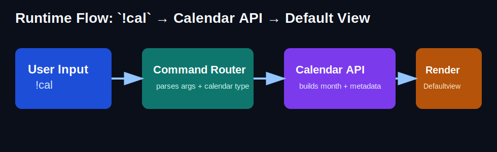
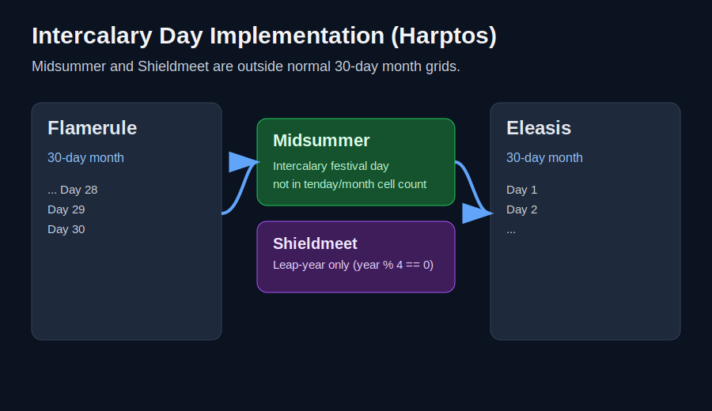
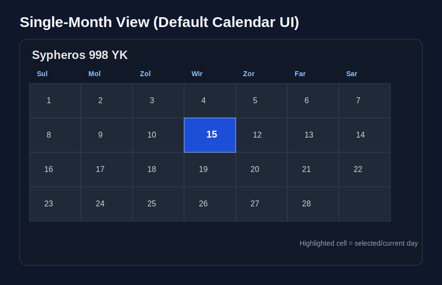
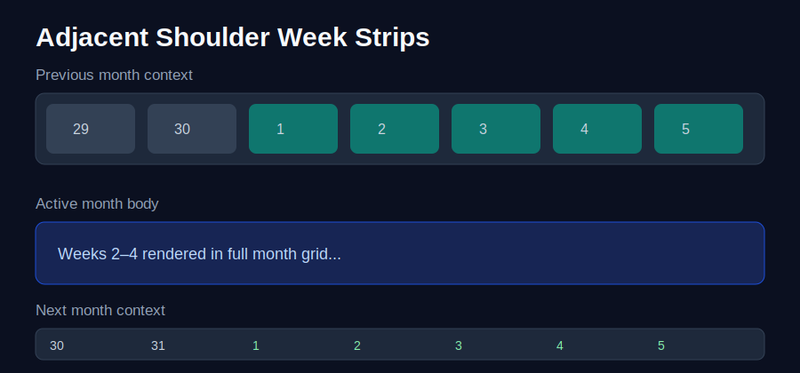

# Calendar Layout

This file is the unified calendar design reference for the project.

It merges the former structure and era-label docs into a single source of truth aligned to `calendar.js`.

---

## Scope

The calendar engine currently supports three base calendar systems:

1. **Eberron (Galifar / YK)**
2. **Faerûn (Harptos / DR)**
3. **Gregorian (Western / Earth-standard naming)**

For each system, this document captures:

- Core structure (months, days, week model, leap/intercalary behavior)
- Naming sets used in script defaults/variants
- Era labels and date-writing conventions
- Notes on implementation details that affect display

---

## Script-aligned canonical layout

## 1) Eberron (Galifar)

### Core structure

- **Year length:** 336 days.
- **Months:** 12 months × 28 days each.
- **Week length:** 7 days.
- **Weekdays:** Sul, Mol, Zol, Wir, Zor, Far, Sar.
- **Intercalary days:** none.
- **Leap handling:** none.

### Month naming variants in script

- **Standard (Galifar):**
  Zarantyr, Olarune, Therendor, Eyre, Dravago, Nymm,
  Lharvion, Barrakas, Rhaan, Sypheros, Aryth, Vult.
- **Druidic:**
  Frostmantle, Thornrise, Treeborn, Rainsong, Arrowfar, Sunstride,
  Glitterstream, Havenwild, Stormborn, Harrowfall, Silvermoon, Windwhisper.
- **Halfling:**
  Fang, Wind, Ash, Hunt, Song, Dust, Claw, Blood, Horn, Heart, Spirit, Smoke.
- **Dwarven:**
  Aruk, Lurn, Ulbar, Kharn, Ziir, Dwarhuun, Jond, Sylar, Razagul, Thazm, Drakhadur, Uarth.

### Era + date format

- **Era label:** `YK` (Year of the Kingdom).
- **Lore-authentic style:** `15 Sypheros 998 YK` (optional weekday: `Sul, 15 Sypheros 998 YK`).
- **Current default formatter behavior in script:** `Sypheros 15, 998 YK`.

---

## 2) Faerûn (Calendar of Harptos)

### Core structure

- **Year length:** 365 days (366 on Shieldmeet years).
- **Regular months:** 12 months × 30 days each.
- **Week/tenday model:** 10-day cycle.
- **Displayed tenday columns:** 1st through 10th.

### Month names

Hammer, Alturiak, Ches, Tarsakh, Mirtul, Kythorn,
Flamerule, Eleasis, Eleint, Marpenoth, Uktar, Nightal.

### Intercalary festivals and leap handling

Intercalary one-day festivals are inserted between months:

- Midwinter (between Hammer and Alturiak)
- Greengrass (between Tarsakh and Mirtul)
- Midsummer (between Flamerule and Eleasis)
- Highharvestide (between Eleint and Marpenoth)
- Feast of the Moon (between Uktar and Nightal)

Leap festival:

- **Shieldmeet** (1 day) follows Midsummer every 4 years (`year % 4 === 0`).

### Era + date format

- **Era label:** `DR` (Dalereckoning).
- **Regular day format:** `Nth of <Month>, <Year> DR` (example: `16th of Eleasis, 1491 DR`).
- **Festival day format:** `<Festival>, <Year> DR` (example: `Greengrass, 1491 DR`).

---

## 3) Gregorian (Traditional American/Western)

### Core structure

- **Month model:** 12 months with standard lengths:
  31, 28, 31, 30, 31, 30, 31, 31, 30, 31, 30, 31.
- **Month names:**
  January, February, March, April, May, June,
  July, August, September, October, November, December.
- **Week length:** 7 days.
- **Weekdays:** Sunday, Monday, Tuesday, Wednesday, Thursday, Friday, Saturday.
- **Weekday abbreviations:** Sun, Mon, Tue, Wed, Thu, Fri, Sat.
- **Intercalary days:** Leap Day (intercalary; after February; leap years only).

### Leap handling

- Gregorian includes **Leap Day** as a 1-day intercalary entry after February.
- Leap Day appears every 4 years (`year % 4 === 0`).
- Total year length is 365 days normally, 366 on leap years.

### Era + date format

- **Era label:** configurable global label (script default is `YK` unless changed).
- **Default rendered style:** `<Month> <Day>, <Year> <ERA>`.
- For Gregorian campaigns, a typical choice is to set ERA to a real-world style marker (or blank, if desired).

---

## Presentation + inline imagery in GitHub Markdown

Yes—this is fully possible. GitHub renders inline images in Markdown when they are committed to the repository and referenced by relative path.

### What GitHub Markdown can do

- Display inline raster or vector files (`.png`, `.jpg`, `.gif`, `.svg`).
- Keep images in-repo (versioned and reviewable in pull requests).
- Mix prose and visuals in a white paper/manual style section-by-section.

### What GitHub Markdown cannot do by itself

- It cannot execute `!cal` or any runtime API command directly from the Markdown page.
- The image must be generated ahead of time (manually, script-generated, or exported) and committed.

### Suggested workflow

1. Run the calendar API/script for the target scenario (default month, intercalary placement, shoulder strips).
2. Capture or export image artifacts.
3. Save artifacts in `assets/calendar-layout/`.
4. Embed in Markdown with standard image syntax.

### Command-to-view overview

### Intercalary day implementation (example)

### Single-month default calendar view (example)

### Adjacent shoulder week strip view (example)

---

## Shared implementation notes

- Calendar systems are defined in `CALENDAR_SYSTEMS`.
- Harptos intercalary/leap behavior is defined in `CALENDAR_STRUCTURE_SETS.harptos`.
- Date math uses serial conversion that supports optional leap-only slots (used by Shieldmeet).
- Rendering logic respects dynamic week length, so Harptos naturally renders a 10-column layout.
- Seasonal behavior is calendar-aware:
  - Eberron uses planar season naming.
  - Harptos uses 12-entry seasonal mapping.
  - Gregorian uses equinox/solstice transition dates with hemisphere-aware variants.

---

## Practical consistency checklist

- ✅ Eberron (Galifar) layout and weekday naming match script definitions.
- ✅ Harptos month/intercalary/tenday behavior matches script definitions.
- ✅ Gregorian month and weekday naming now documented in the same unified layout file.
- ✅ Gregorian leap-day behavior is documented with its every-4-years implementation.
- ✅ The layout spec now includes inline image examples for command flow, intercalary days, single-month view, and shoulder week strips.
